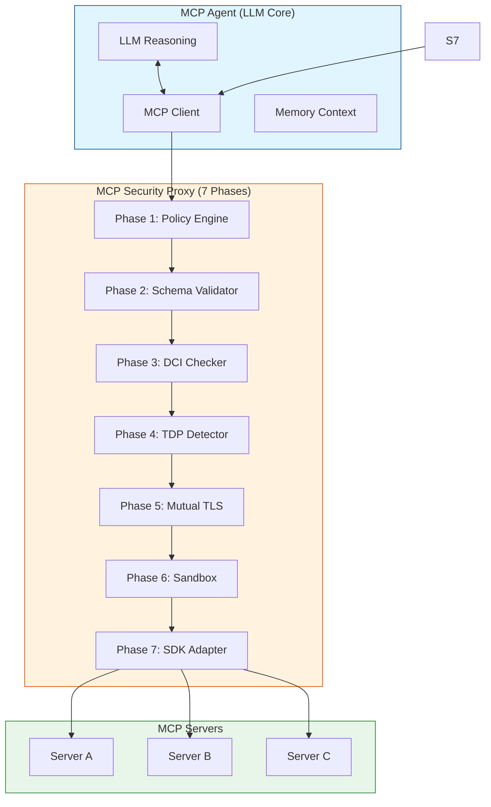

# MCP Core Defense

> **A 7-phase security proxy for Model Context Protocol agent systems.**
> Defends against tool poisoning, description-code inconsistencies, privilege escalation, path traversal, and authentication attacks.


---

## Architecture



## Overview

The Model Context Protocol (MCP) has emerged as a standardized interface for connecting large language models to external tools and data sources. As of mid-2026, the MCP ecosystem encompasses over 2,200 public MCP servers — but empirical studies reveal that **9.93% exhibit description-code inconsistencies** (Shi et al., 2026) and leading models suffer **~100% attack success rates under tool description poisoning** (Liu et al., 2026).

This framework implements a **defense-in-depth security proxy** — the MCP Security Proxy (MCP-SP) — interposed between the agent and all MCP servers. The proxy implements seven sequential verification phases. All 127 tests pass on Python 3.10, 3.11, and 3.12.

---

## Security Architecture

```
┌─────────────────────────────────────────────────────────────────┐
│                      MCP AGENT (LLM Core)                       │
│  ┌──────────┐    ┌──────────┐    ┌──────────┐                  │
│  │  LLM     │◄──►│  MCP     │◄──►│  Memory  │                  │
│  │(Reasoning)│   │  Client  │    │ (Context)│                  │
│  └────┬─────┘    └────┬─────┘    └──────────┘                  │
│       │               │                                         │
└───────┼───────────────┼─────────────────────────────────────────┘
        │ tool/call     │ validated result
        ▼               ▲
┌───────────────────────┼───────────────────────────────────────────┐
│            MCP SECURITY PROXY (MCP-SP)                           │
│                       │                                           │
│  ┌────────────────────▼───────────────────────────────────────┐  │
│  │ Phase 1: POLICY ENGINE                                      │  │
│  │ Deny-by-default allowlist · Wildcards · Read-only context   │  │
│  └────────────────────┬───────────────────────────────────────┘  │
│                       │ PASS                                      │
│  ┌────────────────────▼───────────────────────────────────────┐  │
│  │ Phase 2: SCHEMA VALIDATOR                                   │  │
│  │ Strict JSON schema validation · Nested objects · Arrays     │  │
│  └────────────────────┬───────────────────────────────────────┘  │
│                       │ PASS                                      │
│  ┌────────────────────▼───────────────────────────────────────┐  │
│  │ Phase 3: DCI CHECKER (Shi et al. 2026)                      │  │
│  │ Description-Code Consistency · AST static analysis          │  │
│  │ Python + JavaScript/TypeScript multi-language support        │  │
│  └────────────────────┬───────────────────────────────────────┘  │
│                       │ PASS                                      │
│  ┌────────────────────▼───────────────────────────────────────┐  │
│  │ Phase 4: TDP DETECTOR (Liu et al. 2026)                     │  │
│  │ Tool Description Poisoning scan · Exfil/Exec/Obfuscation    │  │
│  └────────────────────┬───────────────────────────────────────┘  │
│                       │ PASS                                      │
│  ┌────────────────────▼───────────────────────────────────────┐  │
│  │ Phase 5: MUTUAL TLS AUTH (Zhou et al. 2026)                 │  │
│  │ Certificate verification · Pinning · MITM detection         │  │
│  └────────────────────┬───────────────────────────────────────┘  │
│                       │ PASS                                      │
│  ┌────────────────────▼───────────────────────────────────────┐  │
│  │ Phase 6: SANDBOX                                            │  │
│  │ Filesystem jail · Path traversal prevention · Ext. filter   │  │
│  └────────────────────┬───────────────────────────────────────┘  │
│                       │ PASS                                      │
│  ┌────────────────────▼───────────────────────────────────────┐  │
│  │ Phase 7: SDK ADAPTER                                        │  │
│  │ Async MCP client integration · Interceptor · Dry-run mode   │  │
│  └────────────────────┬───────────────────────────────────────┘  │
│                       │                                           │
└───────────────────────┼───────────────────────────────────────────┘
                        │
                        ▼
              ┌──────────────────┐
              │  MCP SERVERS     │
              │  (Remote/Local)  │
              └──────────────────┘
```

---

## Threat Mitigation Matrix

| Threat | Attack Vector | Phase | Mitigation | Reference |
|--------|--------------|-------|------------|-----------|
| Tool Description Poisoning | Malicious instructions in tool metadata | 4 | Regex pattern scan (exfil/execution/obfuscation) | Liu et al. (2026) |
| Description-Code Inconsistency | Tool behavior diverges from description | 3 | AST static analysis + param comparison (Python/JS/TS) | Shi et al. (2026) |
| Authentication Bypass | Weak auth on remote MCP servers | 5 | Mutual TLS + certificate pinning | Zhou et al. (2026) |
| Privilege Escalation | Server exceeds declared permissions | 1 | Deny-by-default allowlist + per-tool scope | Metere (2026) |
| Indirect Prompt Injection | Malicious content in tool results | 2 | Strict schema validation + output sanitization | Greshake et al. (2023) |
| Tool Shadowing | Malicious server impersonates legitimate tool | 5 | Certificate-based server identity | Zhou et al. (2026) |
| Data Exfiltration | Parameters leaked to external endpoints | 1+4 | Policy engine + TDP pattern detection | — |
| Path Traversal | Filesystem escape via `../` in tool args | 6 | Sandbox jail with resolved path validation | — |
| Unauthorized Tool Execution | LLM tricked into calling dangerous tools | 7 | SDK adapter intercepts all tool calls pre-execution | — |

---

## Project Structure

```
mcp-core-defense/
├── src/
│   ├── __init__.py
│   ├── policy_engine/          # Phase 1: Deny-by-default access control
│   │   ├── __init__.py         # Exports: MCPSecurityPolicyEngine, AccessDeniedError
│   │   └── engine.py           # Policy evaluation with wildcards + context
│   ├── validators/             # Phase 2: JSON Schema validation
│   │   ├── __init__.py         # Exports: MCPSchemaValidator, SchemaValidationError
│   │   └── schema_validator.py # Strict I/O validation, nested objects, arrays
│   ├── detectors/              # Phases 3+4: DCI + TDP detection
│   │   ├── __init__.py         # Exports: DCIChecker, TDPDetector, ...
│   │   ├── dci_checker.py      # Description-Code Consistency (Python/JS/TS)
│   │   └── tdp_detector.py     # Tool Description Poisoning (regex patterns)
│   ├── auth/                   # Phase 5: Mutual TLS authentication
│   │   ├── __init__.py         # Exports: MutualTLSHandler, ...
│   │   └── mtls.py             # Certificate verification + pinning
│   ├── sandbox/                # Phase 6: Filesystem sandbox
│   │   ├── __init__.py
│   │   └── sandbox.py          # Path traversal prevention + extension filter
│   ├── pipeline.py             # Orchestrator: 5-phase sequential pipeline
│   └── sdk_integration.py      # Phase 7: Async SDK adapter for MCP clients
├── tests/
│   ├── test_policy_engine.py    # 11 tests
│   ├── test_schema_validator.py # 14 tests
│   ├── test_dci_checker.py      # 19 tests (Python + JS/TS)
│   ├── test_tdp_detector.py     # 11 tests
│   ├── test_mtls.py             # 12 tests
│   ├── test_pipeline.py         # 9 tests
│   ├── test_integration.py      # 11 tests (full pipeline + exports)
│   ├── test_performance.py      # 8 benchmarks (latency, throughput, scalability)
│   ├── test_sandbox.py          # 16 tests
│   ├── test_sdk_integration.py  # 1 test (async SDK adapter)
│   └── __init__.py
├── .github/workflows/
│   └── tests.yml               # CI/CD: tests on Python 3.10/3.11/3.12
├── Makefile                    # Dev workflow: install, test, lint, format, typecheck
├── pyproject.toml              # Packaging: pip install -e ".[dev]"
├── requirements.txt            # Runtime + test dependencies
├── CONTRIBUTING.md             # Dev setup + TDD rules + code standards
├── LICENSE                     # AGPL-3.0-or-later
└── README.md                   # This file
```

---

## Security Audit Tool

Incluimos `scripts/mcp_audit.py` — un auditor de seguridad para servidores MCP que puedes usar **antes** de añadir un servidor a tu agente:

```bash
# Auditar un servidor desde su definición JSON
python3 scripts/mcp_audit.py server-definition.json

# Ejemplo con servidor malicioso integrado
python3 scripts/mcp_audit.py --example

# Salida JSON (para integración con otros scripts)
python3 scripts/mcp_audit.py server.json --output-json
```

El auditor evalúa cada herramienta contra 7 fases:
- **TDP**: Tool Description Poisoning (exfiltración, ejecución, ofuscamiento)
- **DCI**: Description-Code Inconsistency (parámetros ocultos)
- **Policy**: Deny-by-default allowlist
- **Auth**: Manejo de credenciales/secrets
- **Sandbox**: Parámetros de tipo path/URL (traversal, SSRF)
- **Heuristics**: Descripciones vacías, tipos faltantes, defaults sospechosos

Return codes: `0` = limpio, `1` = low/medium, `2` = high/critical.

**Integración con otros frameworks**: puede importarse como módulo Python:

```python
from mcp_audit import MCPAuditor
auditor = MCPAuditor(server_allowlist=["my::trusted_tool"])
report = auditor.audit_server(tools)
```

## Quick Start

### Instalación rápida (30 segundos)

```bash
# Clonar e instalar
git clone https://github.com/amurlaniakea/mcp-core-defense.git
cd mcp-core-defense
pip install -e .

# Verificar instalación
python3 -c "from src.pipeline import MCPSecurityProxy; print('OK:', MCPSecurityProxy(allowlist=['test']).phases)"
```

### Ejemplo rápido

```python
from src.pipeline import MCPSecurityProxy

# Crear proxy con allowlist
proxy = MCPSecurityProxy(allowlist=["filesystem::read_file", "git::status"])

# Auditar una herramienta
tool = {
    "name": "filesystem::read_file",
    "description": "Read a file from the filesystem",
    "parameters": {
        "type": "object",
        "properties": {"path": {"type": "string"}},
        "required": ["path"]
    }
}

# Verificar contra las 7 fases
result = proxy.check(tool_name=tool["name"])
print(f"Passed: {result.passed}")  # True
print(f"Phases: {proxy.phases}")   # ['policy', 'dci', 'tdp', 'sandbox', 'sdk_adapter']
```

### Ejecutar tests

```bash
# Todos los tests (127)
python3 -m pytest tests/ -v

# Test específico
python3 -m pytest tests/test_pipeline.py -v
```

---

### Prerequisites

- Python >= 3.10
- pip

### Installation

```bash
git clone https://github.com/amurlaniakea/mcp-core-defense.git
cd mcp-core-defense
python3 -m venv venv
source venv/bin/activate
make install
```

### Running Tests

```bash
# Full suite (127 tests)
make test

# Specific phase
make test-phase1    # Policy Engine
make test-phase2    # Schema Validator
make test-phase3    # DCI Checker
make test-phase4    # TDP Detector
make test-phase5    # Mutual TLS
make test-pipeline  # Pipeline + Integration
make test-perf      # Performance benchmarks

# With coverage
make test-verbose

# All checks (lint + typecheck + test)
make check
```

### Usage

```python
from src.policy_engine import MCPSecurityPolicyEngine
from src.validators import MCPSchemaValidator
from src.detectors import DCIChecker, TDPDetector
from src.auth import MutualTLSHandler
from src.pipeline import MCPSecurityProxy
from src.sandbox import Sandbox
from src.sdk_integration import MCPSecuritySDKAdapter

# Phase 1: Policy Engine
engine = MCPSecurityPolicyEngine(allowlist=["filesystem::read_file", "git::*"])
engine.check("filesystem::read_file")  # True
engine.check("malicious::exec")        # raises AccessDeniedError

# Phase 2: Schema Validator
validator = MCPSchemaValidator(schema={
    "type": "object",
    "properties": {"path": {"type": "string"}},
    "required": ["path"],
})
validator.validate_input({"path": "/file.txt"})  # True

# Phase 3: DCI Checker (Python + JS/TS)
checker = DCIChecker()
checker.check(tool_description, code_params=["path"])  # True
checker.analyze_static(tool_description, js_code, language="typescript")  # True

# Phase 4: TDP Detector
detector = TDPDetector()
detector.check(tool_description)  # True or raises TDPAttackDetected

# Phase 5: Mutual TLS
handler = MutualTLSHandler(trusted_certs=[ca_cert_pem])
handler.verify_certificate(server_cert, expected_hostname="mcp-server.local")

# Full Pipeline (Phases 1-5)
proxy = MCPSecurityProxy(
    allowlist=["filesystem::read_file"],
    schema={"type": "object", "properties": {"path": {"type": "string"}},  # Phase 2
)
result = proxy.check(
    tool_name="filesystem::read_file",
    tool_description=tool_desc,     # Phases 3-4
    code_params=["path"],           # Phase 3
    input_data={"path": "/test.txt"},  # Phase 2
)
print(result.passed)  # True

# Phase 6: Sandbox
with Sandbox(allowed_extensions=[".txt", ".csv"]) as s:
    safe_path = s.resolve("data/file.txt")
    s.write_file("data/file.txt", "hello")
    content = s.read_file("data/file.txt")

# Phase 7: SDK Adapter (async)
adapter = MCPSecuritySDKAdapter(proxy)
result = await adapter.secure_tool_execution(
    tool_name="filesystem::read_file",
    arguments={"path": "/test.txt"},
    original_execute_func=mcp_client.execute,
)
```

---

## Test Results

```
112 passed in 2.05s

Phase 1 (Policy Engine):        11 tests
Phase 2 (Schema Validator):     14 tests
Phase 3 (DCI Checker):          19 tests  (Python + JS/TS)
Phase 4 (TDP Detector):         11 tests
Phase 5 (Mutual TLS Auth):      12 tests
Pipeline Orchestrator:           9 tests
Integration (Full Pipeline):    11 tests
Performance (Benchmarks):        8 tests
Sandbox (Fase 6):               16 tests
SDK Adapter (Fase 7):            1 test
```

All tests follow strict TDD — no production code without a failing test first.

### Performance

| Metric | Value |
|--------|-------|
| Policy Engine (per check) | < 1ms |
| Schema Validator (per validation) | < 1ms |
| DCI Checker (per analysis) | < 5ms |
| TDP Detector (per scan) | < 5ms |
| Full Pipeline (avg) | < 20ms |
| Full Pipeline (p95) | < 50ms |
| Throughput | > 100 checks/sec |
| Policy Engine (1000 tools) | < 2ms |
| TDP Detector (10KB description) | < 10ms |

---

## Research Basis

- **[Shi et al. (2026)](https://arxiv.org/abs/2606.04769)** — Description-Code Inconsistency in Real-world MCP Servers
- **[Liu et al. (2026)](https://arxiv.org/abs/2605.24069)** — When the Manual Lies: A Realistic Benchmark for MCP Poisoning
- **[Zhou et al. (2026)](https://arxiv.org/abs/2605.22333)** — Authentication Security in Remote MCP Servers
- **[Wang et al. (2026)](https://arxiv.org/abs/2606.01991)** — SafeMCP: Proactive Power Regulation for LLM Agent Defense
- **[Metere (2026)](https://arxiv.org/abs/2605.24248)** — Attested Tool-Server Admission
- **[He & Yu (2026)](https://arxiv.org/abs/2606.11632)** — Sovereign Assurance Boundary
- **[Greshake et al. (2023)](https://arxiv.org/abs/2302.12173)** — Indirect Prompt Injection in LLM-Integrated Applications

---

## License

AGPL-3.0-or-later — see [LICENSE](LICENSE) for details.

### Commercial Licensing

Need to use MCP Core Defense in a closed-source commercial product or internal enterprise environment? Commercial licenses and support contracts are available.

**Contact:** Pedro Sordo Martínez — [amurlaniakea@gmail.com](mailto:amurlaniakea@gmail.com)
